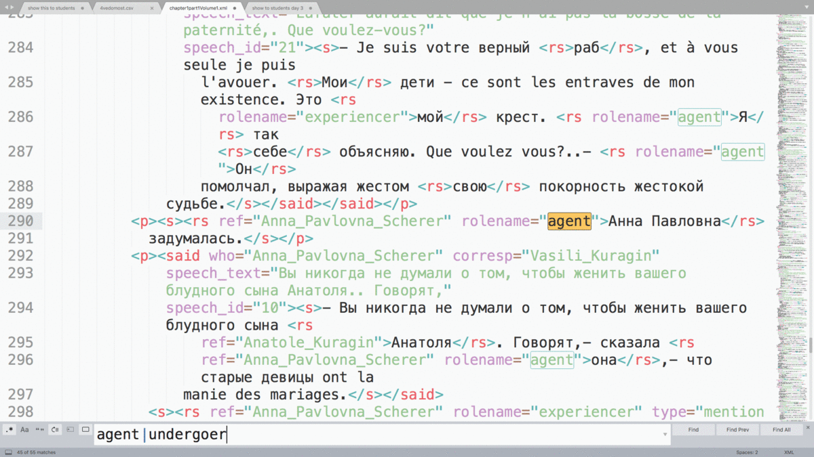

## Инструкция по разметке семантических ролей в романе "Война и мир" для практикантов


### Основная задача 
#### легкая с т.з. интеллектуальных усилий, делается руками

[Вот тут](markup) лежат XML-документы с главами "Войны и мира". В этих текстах размечены:

1. Упоминания персонажей, в т.ч. анафорические. Тег [```<rs>```](https://tei-c.org/release/doc/tei-p5-doc/en/html/ref-rs.html) из стандарта TEI ( ```rs``` означает referring string, то есть любая строка, за которой стоит сущность-референт; т.е. семантика этого тега в TEI -- примерно "любая именованная сущность"). Всем персонажам романа, кроме эпизодических, присвоены уникальные ID ("Pierre_Bezukhov", "Natasha_Rostova", "Vasili_Kuragin" и т.п.), ссылка на которые хранится в атрибуте ``` @ref ```. Выглядит как-то так:
```<rs ref="Pierre_Bezukhov">Он</rs>, казалось, не мог переносить вида слез```

1. Прямая речь персонажа с указанием ID говорящего, адресата речи и самого текста реплики. Помечается тегом [```<said>```](https://tei-c.org/release/doc/tei-p5-doc/en/html/ref-said.html). В этом задании прямая речь нам не очень важна. 

1. [Семантические роли](https://ru.wikipedia.org/wiki/%D0%A1%D0%B5%D0%BC%D0%B0%D0%BD%D1%82%D0%B8%D1%87%D0%B5%D1%81%D0%BA%D0%B0%D1%8F_%D1%80%D0%BE%D0%BB%D1%8C) (т.н. глубинные позиции), в которых оказываются упоминания персонажей. О семантических ролях в лингвистике см. также [этот хэндаут](http://www.philol.msu.ru/~otipl/new/main/courses/syntax/05_Semroli_i_interfejs.pdf). В нашей разметке используется упрощенная модель: основных ролей сейчас всего три.

      – 3.1. Агенс ("agent") — когда персонаж совершает любое активное действие, хоть как-то регистрируемое внешней средой: (говорить, жестикулировать, ехать)
      
      – 3.2. Пациенс/Объект ("undergoer") — когда персонаж претерпевает действие или является объектом разговора, восприятия и т.п.)
      
      – 3.3. Экспериенцер ("experiencer") — когда персонаж что-то думает, чувствует, видит. Т.е. перцепция или мыслительная активность, не имеющая выражения во внешней среде. 

Семантическая роль указывается в атрибуте ``` @rolename ``` уже знакомого вам тега ```rs```. Пример:

 ```Так говорила в июле 1805 года известная <rs ref="Anna_Pavlovna_Scherer" rolename="agent" subrole="speaker">Анна Павловна Шерер</rs>, фрейлина и приближенная <rs ref="empress_Mariya">императрицы Марии Феодоровны</rs>, встречая важного и чиновного <rs ref="Vasili_Kuragin" rolename="undergoer">князя Василия</rs>```

В разметке также встречаются иные роли, например, possessor (обладатель чего-то). Эту роль можно пока игнорировать. Сейчас она в первую очередь размечена в конструкциях вида "рука Пьера". Нас же будут интересовать лишь те случаи, когда упоминание персонажа напрямую зависит в предложении от какого-то предиката (глагола, отглагольного существительного, деепричастия, причастия).  

### Описание основной задачи:

Нужно 
1. выбрать себе сколько-то глав. Для начала можно, например, 5.
2. Записаться разметчиком этих глав [в этой таблице](https://docs.google.com/spreadsheets/d/1SrwyElciSO9hX0Gy0CqIHlS-VEqfB1n_JBLHz8EhmI0/edit?usp=sharing)
3. Сохранить себе эти главы [отсюда](markup)
4. Открыть в любом удобном вам редакторе с подсветкой XML-синтаксиса (Notepad++ / Sublime / Atom / VS Code  ... — на ваш вкус. Знакомые с Oxygen XML editor могут пользоваться им). Если не знаете, что взять, и у вас Windows, берите Notepad++.
5. Пройти по всем местам, где у персонажа указан rolename "undergoer" или "agent" и заменить на experiencer там, где речь идет о том, что персонаж что-то думает, чувствует, видит. Сейчас из-за несовершенства инструмента разметки, который тут когда-то использовался, во многих случаях experiencer не определился. Он превратился либо в agent. 

Процедура исправления выглядит как-то так: 

 
6. Загрузить файлы [в эту папку](https://drive.google.com/drive/folders/1qNfOc-1fBhqKZyLSKaBAXGcZu-B-4mH-?usp=sharing) и сказать об этом мне. Или, если вы знакомы с гитом, вы можете не грузить файлы, а форкнуть репозиторий, внести в файлы исправления, закоммитить их в свой форк, а потом сделать pull request. В принципе с педагогической точки зрения будет лучше, если вы будете пользоваться гитом. Но заставлять не буду :) 
7. Дальше можно брать следующие 5 или больше глав, пока не кончится роман или ваше желание этим заниматься. 

### Дополнительная задача (посложнее и требует автоматизации)

Более сложная задача здесь состоит в том, чтобы связать упоминания персонажей с предикатами. Это нужно, чтобы в последствии уточнить семантические роли до более дробных. Например, разбить Агенса("agent") на подвиды: говорящий ("speaker"), перемещающийся ("traveler"), агент физического воздействия и т.п. Так же можно разбивать и пациенса, и экспериенцера -- и все это можно делать исходя из семантики глагола: Пьер *поехал*, Пьер *сказал*, Пьер *поднял* и т.п. 

Представляется, что для это задачи нужно: 

1. Выделить тегами все глаголы, синтаксическими зависимыми которых являются упоминания персонажей. Для начала можно не запариваться и выделить все глаголы :)  
2. Сгенерировать и присвоить всем таким глаголам уникальные идентификаторы. 
3. Свзяать глаголы с упоминанием через этот идентификатор. Выглядеть может как-то так: 
``` Так <v id="314159">говорила</v> в июле 1805 года известная <rs ref="Anna_Pavlovna_Scherer" rolename="agent" subrole="speaker" head='314159'>Анна Павловна Шерер</rs>, фрейлина и приближенная <rs ref="empress_Mariya">императрицы Марии Феодоровны</rs>, <v id="265358">встречая</v> важного и чиновного <rs ref="Vasili_Kuragin" rolename="undergoer" head="265358">князя Василия</rs> ```

Пункты 1-2 точно нужно делать автоматически. Но с т.з. алгоритмизации задача тривиальна. Пункт 3 менее тривиален в реализации и требует предварительного анализа. Оценить: стоит ли подключать полноценный синтаксический парсер, или можно обойтись морфологией и эвристиками на регекспах. Ручная доразметка возможна. 

### Дополнительная задача 2 (еще сложнее, требует продумывания и автоматизации)

Разметив таким образом глаголы (см. дополнительную задачу 1), можно попробовать реализовать разделение семантических ролей на подвиды. Агенс может быть разбит на такие роли, как говорящий ("speaker"), перемещающийся ("traveler"), агент физического воздействия и т.п. Экспериенцер -- на мыслящего, видящего, чувствующего и т.п. См. например эту иерархию семантических ролей:

 
